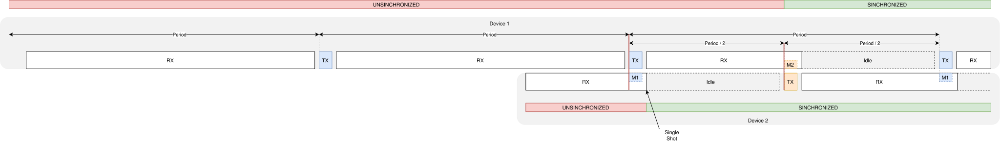

Opener dectnrp driver
#####################

Overview
********

This sample shows how to include the Opener NR+ stack as an out-of-tree Zephyr module 
in your project and start using the dectnrp driver API directly without upper l2 layer.
This sample specifically demonstrates transmission and reception.

The main flow of this app is as follows:

.. code-block::

    Boot  
     ↓  
    Init  
     ↓  
    receive  
     ↓   ↑  
    transmit  

In initialization phase it provides the network-id to the driver and initializes the local device.
The long-id is created from chip id and is unique as long as we only use Nordic chips.
The short-id is randomly created. The remote device is not known yet at that stage.

After initialization it periodically cycles between reception and transmission.
Initially it is in un-synchronized mode which means it uses the fixed, pre-configured period for reception and to transmit its messages.

.. code-block::

  period(unsynchronized) = CONFIG_DECTNRP_SAMPLE_PERIOD

  |<---------------- period ---------------->|<---------------- period ---------------->|
  | RX                                    |TX| RX                                    |TX|   ...  

**Synchronization process**

Above scheme will demonstrate imediate scheduling of rx and tx operations (start_time=0). Only one device is needed.
To also demonstrate modem-based time scheduling (start_time is a valid modem-time in the future) you need a second device.

For this sample a simple ping-pong communication is choosen, where both devices do not have to know each other in advance.
They synchronize against another using the start-time of received messages.

When Device 2 received a message transmitted from Device 1 it also has got the start-time of that message. 
Based on that start-time it alligns its own transmission and reception to the cycle of the Device 1.
Together with that messge it also learns the short-id of the remote device 

.. code-block::

  Period(unsynchronized) = CONFIG_DECTNRP_SAMPLE_PERIOD
  Period(synchronized) = CONFIG_DECTNRP_SAMPLE_PERIOD/2

* Device 1 does TX-RX with pre-configured unsynchronized period (starting with RX)
* Device 2 does TX-RX with pre-configured unsynchronized period (also starting with RX)
* Device 2 receives message M1 sent by Device 1 (RX in single shot mode)

  * It got the start time of M1 from its driver and synchronizes sending of its own message M2 to synchronized period/2
  * It also learned the short id of the remote device and is in SYNCHRONIZED mode now
* Device 1 receives message M2 sent by Device 2 (RX in single shot mode)

  * It got the start time of M2 from its driver and also synchronizes sending of its own message M1 to synchronized period/2
  * It also learned the short id of the remote device and is in SYNCHRONIZED mode now

When no message has been received within the rx operation window the state changes back into UNSYNCHRONIZED mode.

Usage
*****

This sample is currently meant to run on nRF9151dk board(s). 
For single device tests you can run it on one board. For testing real communication you should have two of them ready.

If you are using vscode the attached `sample-linux.code-workspace <../../sample-linux.code-workspace>`_ contains some build and flash tasks and additionally debug launch configurations.

* Adjust ``CONFIG_DECTNRP_SAMPLE_CHANNEL`` and other project settings in `prj.conf <prj.conf>`_ to your needs.
* Assuming you have one/two SEGGER JLink override there serials (see ``device1-serial-number`` and ``device2-serial-number``) to ``.vscode/settings.json`` or directly override values in `sample-linux.code-workspace <../../sample-linux.code-workspace>`_.
* Build sample *dectnrp_driver* as descriped in top-level README.md or using vscode tasks.
* Connect one nrf9151dk (device 1) via USB.
* When you directly run ``Device1(launch)``

  * the sample should be uploaded
  * a RTT-terminal ``Device 1`` with the log should be opened
  * the sample should stop at main()
* If you continue the debugger the logger ``Device 1`` should show something like this:

.. code-block::

    [00:00:00.553,436] <wrn> dectnrp_nrf91: MFW version:mfw-nr+-phy_nrf91x1_2.0.0
    [00:00:00.553,924] <wrn> dectnrp_nrf91: MFW uuid:75a511eb-5f17-488b-bb61-b1d29bfaabe0
    [00:00:00.553,955] <wrn> dectnrp_nrf91: MFW lib-version:3.2.2-dectphy-369d28b2e47c
    [00:00:00.698,089] <inf> dectnrp_nrf91: nrf91 dectnrp radio initialized
    [00:00:00.698,303] <inf> dectnrp_nrf91: nrf91_configure(dectnrp_nrf91)
    [00:00:00.698,303] <inf> dectnrp_nrf91: Iface initialized
    [00:00:00.699,127] <inf> dectnrp_nrf91: nrf91_start(dectnrp_nrf91)
    [00:00:00.746,856] <inf> dectnrp_nrf91: DECT radio nrf91 started
    *** Booting nRF Connect SDK v3.2.4-4c3fc0d44534 ***
    *** Using Zephyr OS v4.2.99-9673eec75908 ***
    [00:00:23.146,301] <inf> dectnrp_nrf91: nrf91_configure(dectnrp_nrf91)
    [00:00:23.147,094] <inf> dectnrp_driver_sample: -------------------------
    [00:00:23.147,125] <inf> dectnrp_driver_sample: Local device:
    [00:00:23.147,125] <inf> dectnrp_driver_sample:  DEVICE_STATE_UNSYNCHRONIZED
    [00:00:23.147,125] <inf> dectnrp_driver_sample:  - network id 0x32545279
    [00:00:23.147,155] <inf> dectnrp_driver_sample:  - long device id 0xa7a95ba7
    [00:00:23.147,155] <inf> dectnrp_driver_sample:  - short device id 0x90f2
    [00:00:23.147,186] <inf> dectnrp_driver_sample:  - channel 1677
    [00:00:23.147,186] <inf> dectnrp_driver_sample: -------------------------
    [00:00:23.147,216] <inf> dectnrp_driver_sample: receive ...
    [00:00:26.147,949] <inf> dectnrp_driver_sample: receive complete
    [00:00:26.148,254] <inf> dectnrp_driver_sample: transmit
    [00:00:26.149,230] <inf> dectnrp_driver_sample: transmit complete

* The sample just listens but does not receive anything but sends its own message periodically.

* Now connect second nrf9151dk (device 2) via USB.
* When you directly run ``Device2(launch)``

  * the sample should also be uploaded
  * a RTT-terminal ``Device 2`` with the log should be opened
  * the sample should stop at main()
* If you continue the debugger the logger of should show something like this:

.. code-block::

    [00:00:00.524,536] <wrn> dectnrp_nrf91: MFW version:mfw-nr+-phy_nrf91x1_2.0.0
    [00:00:00.524,993] <wrn> dectnrp_nrf91: MFW uuid:75a511eb-5f17-488b-bb61-b1d29bfaabe0
    [00:00:00.525,024] <wrn> dectnrp_nrf91: MFW lib-version:3.2.2-dectphy-369d28b2e47c
    [00:00:00.669,128] <inf> dectnrp_nrf91: nrf91 dectnrp radio initialized
    [00:00:00.669,342] <inf> dectnrp_nrf91: nrf91_configure(dectnrp_nrf91)
    [00:00:00.669,342] <inf> dectnrp_nrf91: Iface initialized
    [00:00:00.670,135] <inf> dectnrp_nrf91: nrf91_start(dectnrp_nrf91)
    [00:00:00.717,895] <inf> dectnrp_nrf91: DECT radio nrf91 started
    *** Booting nRF Connect SDK v3.2.4-4c3fc0d44534 ***
    *** Using Zephyr OS v4.2.99-9673eec75908 ***
    [00:00:30.178,039] <inf> dectnrp_nrf91: nrf91_configure(dectnrp_nrf91)
    [00:00:30.178,833] <inf> dectnrp_driver_sample: -------------------------
    [00:00:30.178,833] <inf> dectnrp_driver_sample: Local device:
    [00:00:30.178,863] <inf> dectnrp_driver_sample:  DEVICE_STATE_UNSYNCHRONIZED
    [00:00:30.178,863] <inf> dectnrp_driver_sample:  - network id 0x32545279
    [00:00:30.178,894] <inf> dectnrp_driver_sample:  - long device id 0x2959b498
    [00:00:30.178,894] <inf> dectnrp_driver_sample:  - short device id 0xf777
    [00:00:30.178,894] <inf> dectnrp_driver_sample:  - channel 1677
    [00:00:30.178,924] <inf> dectnrp_driver_sample: -------------------------
    [00:00:30.178,955] <inf> dectnrp_driver_sample: receive ...
    [00:00:32.212,738] <inf> dectnrp_driver_sample: RX:PCC:
                                                    10 79 90 f2 71 ff ff 00  00 00                   |.y..q... ..      
    [00:00:32.212,799] <inf> dectnrp_driver_sample: PDC:
                                                    00 00 17 43 0d 48 65 6c  6c 6f 20 57 6f 72 6c 64 |...C.Hel lo World
                                                    21 0a 40 11 00 00 00 00  00 00 00 00 00 00 00 00 |!.@..... ........
                                                    00 00 00 00 00                                   |.....            
    [00:00:32.212,829] <inf> dectnrp_driver_sample: receive complete
    [00:00:33.712,951] <inf> dectnrp_driver_sample: -------------------------
    [00:00:33.712,951] <inf> dectnrp_driver_sample: Local device:
    [00:00:33.712,982] <inf> dectnrp_driver_sample:  DEVICE_STATE_SYNCHRONIZED
    [00:00:33.712,982] <inf> dectnrp_driver_sample: Remote device:
    [00:00:33.713,012] <inf> dectnrp_driver_sample:  - short device id 0x90f2
    [00:00:33.713,012] <inf> dectnrp_driver_sample: -------------------------
    [00:00:33.713,287] <inf> dectnrp_driver_sample: transmit
    [00:00:33.714,263] <inf> dectnrp_driver_sample: transmit complete
    [00:00:33.714,355] <inf> dectnrp_driver_sample: receive ...
    [00:00:35.216,247] <inf> dectnrp_driver_sample: RX:PCC:
                                                    10 79 90 f2 71 f7 77 00  00 00                   |.y..q.w. ..      
    [00:00:35.216,308] <inf> dectnrp_driver_sample: PDC:
                                                    00 00 17 43 0d 48 65 6c  6c 6f 20 57 6f 72 6c 64 |...C.Hel lo World
                                                    21 0a 40 11 00 00 00 00  00 00 00 00 00 00 00 00 |!.@..... ........
                                                    00 00 00 00 00                                   |.....            
    [00:00:35.216,339] <inf> dectnrp_driver_sample: receive complete
    [00:00:36.716,705] <inf> dectnrp_driver_sample: transmit
    [00:00:36.717,681] <inf> dectnrp_driver_sample: transmit complete

* Also the logger ``Device 1`` should now have logged out progress:

.. code-block::

    [00:00:38.157,745] <inf> dectnrp_driver_sample: receive ...
    [00:00:41.158,477] <inf> dectnrp_driver_sample: receive complete
    [00:00:41.158,782] <inf> dectnrp_driver_sample: transmit
    [00:00:41.159,759] <inf> dectnrp_driver_sample: transmit complete
    [00:00:41.159,851] <inf> dectnrp_driver_sample: receive ...
    [00:00:42.661,743] <inf> dectnrp_driver_sample: RX:PCC:
                                                    10 79 f7 77 71 90 f2 00  00 00                   |.y.wq... ..      
    [00:00:42.661,804] <inf> dectnrp_driver_sample: PDC:
                                                    00 00 17 43 0d 48 65 6c  6c 6f 20 57 6f 72 6c 64 |...C.Hel lo World
                                                    21 0a 40 11 00 00 00 00  00 00 00 00 00 00 00 00 |!.@..... ........
                                                    00 00 00 00 00                                   |.....            
    [00:00:42.661,834] <inf> dectnrp_driver_sample: receive complete
    [00:00:44.162,017] <inf> dectnrp_driver_sample: -------------------------
    [00:00:44.162,048] <inf> dectnrp_driver_sample: Local device:
    [00:00:44.162,048] <inf> dectnrp_driver_sample:  DEVICE_STATE_SYNCHRONIZED
    [00:00:44.162,048] <inf> dectnrp_driver_sample: Remote device:
    [00:00:44.162,078] <inf> dectnrp_driver_sample:  - short device id 0xf777
    [00:00:44.162,078] <inf> dectnrp_driver_sample: -------------------------
    [00:00:44.162,353] <inf> dectnrp_driver_sample: transmit
    [00:00:44.163,330] <inf> dectnrp_driver_sample: transmit complete
    [00:00:44.163,421] <inf> dectnrp_driver_sample: receive ...
    [00:00:45.665,222] <inf> dectnrp_driver_sample: RX:PCC:
                                                    10 79 f7 77 71 90 f2 00  00 00                   |.y.wq... ..      
    [00:00:45.665,283] <inf> dectnrp_driver_sample: PDC:
                                                    00 00 17 43 0d 48 65 6c  6c 6f 20 57 6f 72 6c 64 |...C.Hel lo World
                                                    21 0a 40 11 00 00 00 00  00 00 00 00 00 00 00 00 |!.@..... ........
                                                    00 00 00 00 00                                   |.....            
    [00:00:45.665,313] <inf> dectnrp_driver_sample: receive complete
    [00:00:47.165,740] <inf> dectnrp_driver_sample: transmit
    [00:00:47.166,717] <inf> dectnrp_driver_sample: transmit complete

* You can see that both devices synchronize to one another and exchange there messages with a period of ``CONFIG_DECTNRP_SAMPLE_PERIOD/2``.
